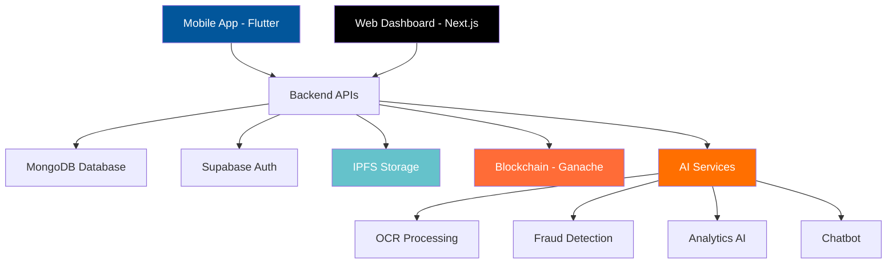

# 💸 Expensync

<div align="center">

**Decentralized Multi-Vendor Expense Tracker**

*Secure, blockchain-powered platform for managing and tracking expenses with transparent workflows and financial integrity*

[](https://choosealicense.com/licenses/mit/)
[](https://nextjs.org/)
[](https://flutter.dev/)
[](https://www.typescriptlang.org/)
[](https://ipfs.io/)

</div>

---

## 📱 Preview

### Web Dashboard
<div align="center">
  
</div>

<div align="center">
  
</div>


### Mobile Application
<div align="center">
  
</div>

---

## 🚀 Features

<table>
<tr>
<td width="50%">

### 🔐 **Security & Blockchain**
- ✅ **Decentralized File Storage** using IPFS
- ✅ **Blockchain Ledger Integration** via Ganache
- ✅ **Encrypted Submissions & Tamper-proof Logs**
- ✅ **Fraud Detection AI** for expense validation

</td>
<td width="50%">

### 👥 **User Experience**
- ✅ **Web2-based Company Login** (no wallets required)
- ✅ **Role-based Dashboards** for Admins and Employees
- ✅ **Real-time Feedback System**
- ✅ **Sleek Animations** using Motion.dev

</td>
</tr>
<tr>
<td width="50%">

### 📊 **Management & Analytics**
- ✅ **Submit & Track Expenses** by category, vendor, project
- ✅ **Approval Workflows** with real-time status tracking
- ✅ **AI-powered Analytics** for spending insights
- ✅ **Budget Management** with automated tracking

</td>
<td width="50%">

### 📱 **Multi-Platform**
- ✅ **Responsive Web Dashboard** for administrators
- ✅ **Flutter Mobile App** for expense submission
- ✅ **OCR Integration** for automatic receipt processing
- ✅ **AI Chatbot** for user support

</td>
</tr>
</table>

---

## 🛠️ Tech Stack

<div align="center">

| **Frontend** | **Backend** | **Blockchain** | **AI/ML** |
|:---:|:---:|:---:|:---:|
|  |  |  |  |
|  |  |  |  |
|  |  |  |  |
|  |  | - |  |

</div>

---

## 🏗️ Architecture Overview



---

## 📂 Project Structure

```
📦 Expensync/
├── 🌐 web/                    # Web frontend (ReactJS + Next.js)
│   ├── components/            # Reusable UI components
│   ├── pages/                 # Next.js pages and routing
│   ├── styles/                # Tailwind CSS configurations
│   └── utils/                 # Helper functions and utilities
├── 📱 mobile/                 # Mobile app (Flutter)
│   ├── lib/                   # Flutter source code
│   ├── assets/                # Images, fonts, and resources
│   └── ocr/                   # OCR module for receipt extraction
├── ⛓️ blockchain/             # Smart contracts and blockchain integration
│   ├── contracts/             # Solidity smart contracts
│   ├── migrations/            # Deployment scripts
│   └── truffle-config.js      # Blockchain configuration
├── 🗄️ storage/               # IPFS integration and file handling
│   ├── ipfs-config.js         # IPFS node configuration
│   └── file-handlers/         # Upload/download utilities
├── 🔐 auth/                   # Authentication and Supabase management
│   ├── supabase-config.js     # Database and auth setup
│   └── middleware/            # Authentication middleware
├── 🤖 ai/                     # AI modules and services
│   ├── chatbot/               # AI assistant and RAG logic
│   ├── fraud_detection/       # ML models for expense validation
│   ├── analytics/             # Data analysis and insights
│   └── ocr/                   # Optical character recognition
├── 🔌 api/                    # Backend API definitions and handlers
│   ├── routes/                # Express.js routes
│   ├── controllers/           # Business logic controllers
│   └── models/                # Data models and schemas
├── 📚 docs/                   # Documentation and API specs
│   ├── api-reference.md       # API documentation
│   ├── setup-guide.md         # Installation instructions
│   └── architecture.md        # System architecture details
└── 📋 README.md               # Project overview (this file)
```

---

## 🚀 Quick Start

### Prerequisites

```bash
# Required software versions
Node.js >= 16.0.0
Flutter >= 3.0.0
MongoDB >= 5.0
Ganache CLI >= 6.12.0
```

### Installation

1. **Clone the repository**
   ```bash
   git clone https://github.com/your-username/expensync.git
   cd expensync
   ```

2. **Install dependencies**
   ```bash
   # Backend dependencies
   npm install
   
   # Frontend dependencies
   cd web && npm install
   
   # Mobile dependencies
   cd ../mobile && flutter pub get
   ```

3. **Environment setup**
   ```bash
   # Copy environment template
   cp .env.example .env
   
   # Configure your environment variables
   # - MongoDB connection string
   # - Supabase credentials
   # - IPFS node configuration
   # - Blockchain network settings
   ```

4. **Start the services**
   ```bash
   # Start blockchain (Ganache)
   npm run blockchain:start
   
   # Deploy smart contracts
   npm run contracts:deploy
   
   # Start backend server
   npm run server:dev
   
   # Start web frontend
   npm run web:dev
   
   # Start mobile app (requires Android/iOS emulator)
   npm run mobile:dev
   ```

---

## 📊 API Reference

### Core Endpoints

#### 💰 Expense Management

```http
POST /api/expenses
```

**Submit a new expense**

```json
{
  "vendorName": "Acme Corp",
  "submittedBy": "Jane Doe",
  "projectName": "Marketing Campaign",
  "expenseType": "Software License",
  "amount": 1200.00,
  "receiptIPFS": "ipfs://QmYourHashHere...",
  "description": "Annual software subscription",
  "status": "Pending"
}
```

#### 📈 Analytics

```http
GET /api/analytics/dashboard
```

**Get dashboard analytics**

```json
{
  "totalRevenue": 268419,
  "newVendors": 32,
  "activeProjects": 15,
  "auditSyncRate": 98,
  "expenditureGraph": [...],
  "recentTransactions": [...]
}
```

### 🔐 Authentication

All API endpoints require authentication via JWT tokens:

```http
Authorization: Bearer <your-jwt-token>
```

---

## 🎯 Subscription Tiers

<div align="center">

| Feature | **Gold** | **Platinum** | **Diamond** |
|:--------|:--------:|:------------:|:-----------:|
| Monthly Expenses | 500 | 2,000 | Unlimited |
| Team Members | 10 | 50 | Unlimited |
| AI Analytics | ✅ Basic | ✅ Advanced | ✅ Premium |
| Fraud Detection | ❌ | ✅ | ✅ |
| Custom Integrations | ❌ | ✅ Limited | ✅ Full |
| **Price/Month** | **$29** | **$99** | **$299** |

</div>

---

## 🤝 Contributing

We welcome contributions from the community! Please follow these steps:

1. **Fork the repository**
2. **Create a feature branch** (`git checkout -b feature/AmazingFeature`)
3. **Commit your changes** (`git commit -m 'Add some AmazingFeature'`)
4. **Push to the branch** (`git push origin feature/AmazingFeature`)
5. **Open a Pull Request**

### Development Guidelines

- Follow the existing code style and conventions
- Write comprehensive tests for new features
- Update documentation for any API changes
- Ensure all CI/CD checks pass before submitting

---

## 📱 Mobile App Features

<table>
<tr>
<td width="50%">

### 📸 **Quick Expense Capture**
- Camera integration for receipt scanning
- OCR for automatic data extraction
- Offline submission capability
- Bulk upload functionality

</td>
<td width="50%">

### 💬 **AI Assistant**
- Natural language expense queries
- Budget tracking and alerts
- Spending pattern insights
- 24/7 chat support

</td>
</tr>
</table>

---

## 🔒 Security Features

- **End-to-end encryption** for all expense data
- **Blockchain immutability** for audit trails
- **Multi-factor authentication** for admin accounts
- **Role-based access control** (RBAC)
- **Automated fraud detection** using AI/ML
- **GDPR compliant** data handling

---

## 📞 Support & Contact

<div align="center">

[](mailto:support@expensync.com)
[](https://docs.expensync.com)
[](https://github.com/your-username/expensync/issues)

</div>

For technical support or feature requests, please:
- 📧 Email us at **support@expensync.com**
- 🐛 Report bugs via [GitHub Issues](https://github.com/your-username/expensync/issues)
- 📖 Check our [Documentation](https://docs.expensync.com)

---

## 📄 License

This project is licensed under the **MIT License** - see the [LICENSE](LICENSE) file for details.

---

<div align="center">

**Built with ❤️ by [M Praneeth](https://github.com/your-username)**

*Empowering organizations with transparent, secure, and intelligent expense management*

[](https://github.com/your-username/expensync)
[](https://github.com/your-username/expensync/fork)

</div>
